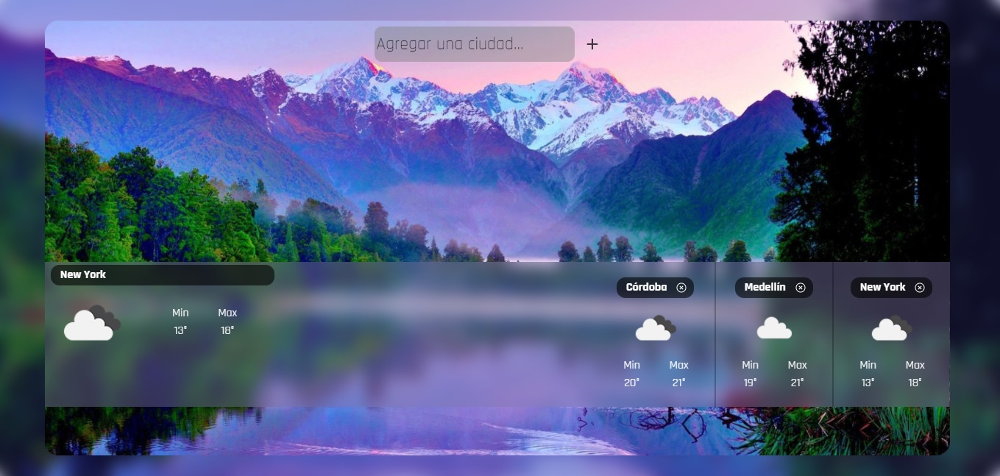
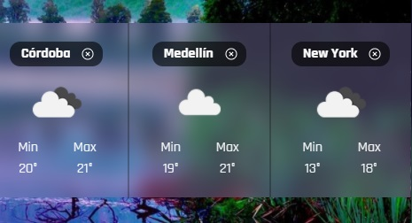

<h1 align='center'>ClimApp</h1>

    

# About

This is a basic weather app made in JavaScript.

It only has one veneer, which has all the logic on the Front-End side.

# Tools implemented

- React
- Fetch
- WebPack
- CSS

# Functionalities

- It has a Search Bar to find the cities that you want to know their climate.

    

- Up to three city cards can be viewed.

    

- Possibility of removing any of these city cards by clicking on the X.

    

<h2 align='center'>Empty ClimApp down here</h2>

    

You can take a look at this App here (soon)